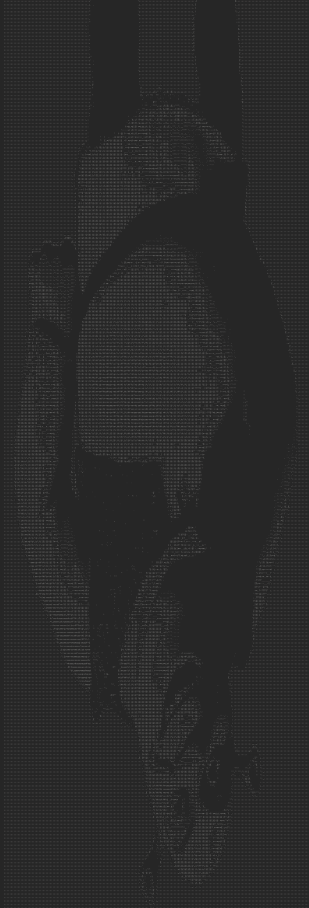

# ASCII Art

The idea of this project is to load images, translate them into ASCII ART images, optionally apply filters, and save them.  
Every component of the project was made in an OOP manner, making it easily extendable with any feature such as: loading images from the web, making new filters, uploading output to the web etc.  
It also features unit tests that test every single component of the project for borderline cases, invalid inputs etc.
## Available options

1. --image PATH
2. --image-random
3. --output-console
4. --output-file PATH
5. --flip y/x
6. --invert
7. --brightness +/-255
8. --table bourke-small/non-linear/CUSTOM

Ordering of the options doesn't matter
Multiple of the same filters can be applied e.g --flip y --flip x

## Running
The program can be compiled and ran with sbt. Note that due to how sbt parses command line arguments, you have to start the sbt shell, then run the applications inside like so:
`sbt`
`run [options]`

## Example run
`run "--image sample_runs/shrek.png --flip x --flip y --brightness -100 --output-file sample_runs/shrek_test.txt"`  

